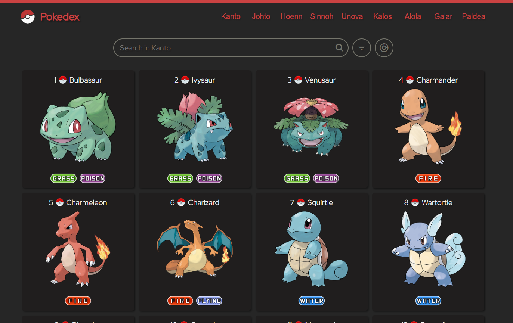

## Pokedex 

Projeto de uma aplicação web simples que simula uma [Pokedex](https://pokemon.fandom.com/pt-br/wiki/Pok%C3%A9dex), utilizando a [PokeAPI](https://pokeapi.co/). 

É possível ver uma lista de todos os Pokemon separados por região, de Kanto até Paldea. Na listagem, também é possível pesquisar os Pokemon por nome, através de uma barra de busca e filtrar os Pokemon por tipo.
Ao clicar em um Pokemon é possível ver suas estatísticas e adicionar ele a sua equipe, que pode ter até 6 Pokemon.

### Tecnologias 

    
    
    

### Execução
Para acessar o projeto basta acessar o link 🔗[Pokedex](https://gabriel-piva.github.io/pokedex) gerado com o [Github Pages](https://pages.github.com/) ou clonar o repositório e abrir o arquivo `index.html` em algum servidor web.

### Objetivo
O projeto tinha como objetivo principal o estudo e prática de HTML, CSS e JavaScript, focando na criação de um layout inteiramente responsivo, na utilização de uma API e no uso do Local Storage, utilizado para salvar a equipe do usuário.

### Referências 
A fonte utilizada vem do [Google Fonts](https://fonts.google.com/specimen/Red+Hat+Display), a biblioteca de ícones é a [Boxicons](https://boxicons.com/), o ícone da página vem do [Icon-Icons](https://icon-icons.com/pt/icone/pokemon/6461) e todas as consultas são realizadas na [PokeAPI](https://pokeapi.co/).